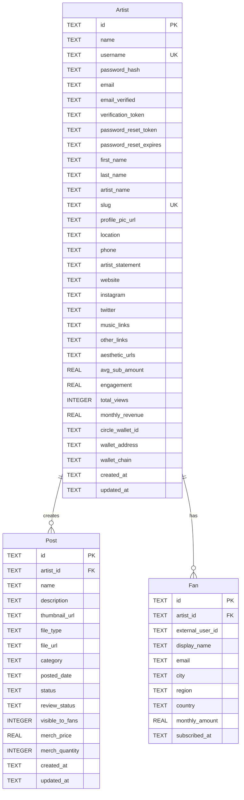

# Joko Artist — SQLite Schema

Database file: `database/database.sqlite` (or `DATA_DIR/database.sqlite` in production).

Migrations run automatically on server start in `server/index.js`. Manual SQL history lives in `database/migrate_*` files.

## Entity relationship diagram

## Wallet fields (Monetization)

| Column | Purpose |
|--------|---------|
| `circle_wallet_id` | Circle developer-controlled wallet ID (platform earnings). Created via onboarding **Create your Wallet** or `POST /api/wallet/provision`. |
| `wallet_address` | External Solana address for USDC withdrawals (Phantom, Solflare, etc.). Set in Monetization → **Manage Wallet**. |
| `wallet_chain` | Circle blockchain label (e.g. `SOL-DEVNET` for testing, `SOL` / mainnet in production). |

**Two-wallet model:** Circle holds USDC earned on-platform; `wallet_address` is where **Transfer Money** sends funds.

## Table summaries

### Artist

Core account, onboarding profile, auth, and wallet linkage.

### Post

Artist content (video, audio, merch, social). `review_status` + `visible_to_fans` gate fan-facing visibility.

### Fan

Per-artist fan/subscriber records. `external_user_id` + `artist_id` is unique when present.

## Indexes

| Index | Table | Columns |
|-------|-------|---------|
| `idx_artist_username` | Artist | `username` (UNIQUE) |
| `idx_fan_artist_external` | Fan | `artist_id`, `external_user_id` (UNIQUE, partial) |
